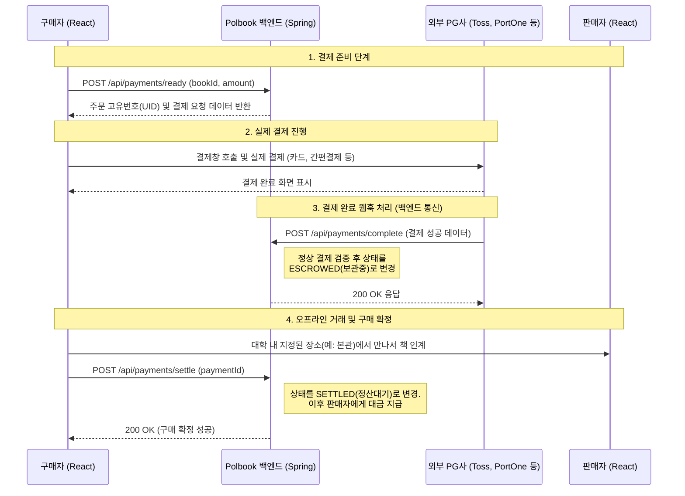

# 🔌 Polbook API 명세서 (RESTful API)

본 문서는 Polbook의 프론트엔드(React)와 백엔드(Spring Boot) 간 통신을 위한 REST API 엔드포인트를 정의합니다.
*   **Base URL:** `http://localhost:8080` (개발 환경) / `https://api.polbook.kopo.ac.kr` (운영 환경)
*   **공통 헤더:** `Authorization: Bearer {JWT_ACCESS_TOKEN}` (로그인 후 모든 요청에 포함)

---

## 1. 🔐 인증 & 인가 (Auth)

| Method | Endpoint | 설명 | Request Body | Response |
|---|---|---|---|---|
| `POST` | `/api/auth/email/send` | 인증 메일 발송 | `{"studentId": "2599999999"}` | `200 OK` |
| `POST` | `/api/auth/email/verify` | 인증번호 확인 | `{"studentId": "...", "code": "123456"}` | `200 OK` (인증 토큰 반환) |
| `POST` | `/api/auth/signup` | 회원가입 | `{"studentId": "...", "password": "...", "nickname": "...", "emailToken": "..."}` | `201 Created` |
| `POST` | `/api/auth/login` | 로그인 | `{"studentId": "...", "password": "..."}` | `200 OK` (accessToken, refreshToken) |
| `POST` | `/api/auth/password/reset` | 비밀번호 재설정 | `{"studentId": "...", "newPassword": "...", "emailToken": "..."}` | `200 OK` |

---

## 2. 🏠 사용자 (Users / MyPage)

| Method | Endpoint | 설명 | Query/Path Params | Response |
|---|---|---|---|---|
| `GET` | `/api/users/me` | 내 프로필 조회 | - | `{"id": 1, "nickname": "...", "mannerScore": 36.5, ...}` |
| `PUT` | `/api/users/me` | 내 프로필 수정 | - | `200 OK` |
| `GET` | `/api/users/{userId}` | 타인 프로필 조회 | Path param: `userId` | `{"nickname": "...", "mannerScore": 37.2, "sellingBooks": [...]}` |

---

## 3. 📖 중고 책 게시글 (Books)

| Method | Endpoint | 설명 | Request/Query Params | Response |
|---|---|---|---|---|
| `GET` | `/api/books` | 책 목록 조회 (홈) | Query: `category`, `status`, `page`, `size`, `sort` | `{"content": [...], "totalPages": 5}` |
| `GET` | `/api/books/{bookId}` | 책 상세 조회 | Path param: `bookId` | 게시글 상세 정보 JSON |
| `POST` | `/api/books` | 새 책 등록 | FormData: JSON(텍스트) + Files(사진) | `201 Created` (bookId 반환) |
| `PUT` | `/api/books/{bookId}` | 등록한 책 수정 | Path: `bookId` + FormData | `200 OK` |
| `DELETE` | `/api/books/{bookId}`| 책 삭제 | Path param: `bookId` | `204 No Content` |
| `PATCH` | `/api/books/{bookId}/status`| 거래 상태 변경 | `{"status": "RESERVED"}` (SELLING/RESERVED/SOLD) | `200 OK` |

---

## 4. ❤️ 찜하기 (Wishlists)

| Method | Endpoint | 설명 | Request Body | Response |
|---|---|---|---|---|
| `POST` | `/api/books/{bookId}/wish` | 찜 토글 (추가/취소) | - | `{"isWished": true, "totalWishes": 5}` |
| `GET` | `/api/users/me/wishlists` | 내 찜 목록 조회 | Query: `page`, `size` | `{"content": [...책정보]}` |

---

## 5. 📍 거래 장소 (Locations)

| Method | Endpoint | 설명 | Response |
|---|---|---|---|
| `GET` | `/api/locations` | 활성화된 거래 장소 목록 | `[{"id": 1, "name": "본관 입구"}, ...]` |

---

## 6. 💬 채팅 (Chat)

> ※ 실제 실시간 채팅은 `WebSocket(STOMP)` 연결 `/ws/chat` 을 통해 이루어지며, 아래는 채팅방 생성/조회를 위한 REST API입니다.

| Method | Endpoint | 설명 | Request Body / Query | Response |
|---|---|---|---|---|
| `POST` | `/api/chats` | 채팅방 생성 (구매자가 클릭 시) | `{"bookId": 123}` | `{"roomId": 45}` |
| `GET` | `/api/chats` | 내 채팅방 목록 조회 | - | `[{"roomId": 1, "lastMessage": "...", "unreadCount": 2, ...}]` |
| `GET` | `/api/chats/{roomId}/messages`| 이전 메시지 내역 불러오기 | Query: `page`, `size` | `[{"senderId": 2, "content": "안녕하세요", "isRead": true}, ...]` |

---

## 7. 💳 결제 및 정산 (에스크로 API)

> **💡 에스크로(안전결제) 진행 흐름 안내**
> 중고 거래 사기를 방지하기 위해 구매자의 돈을 Polbook 서버(PG사)가 임시 보관하다가, 물건을 정상적으로 인계받으면 판매자에게 돈을 지급하는 시스템입니다.
> 
> 1. **결제 준비 (`/ready`)**: 프론트엔드가 백엔드에게 "이 책(15,000원) 결제할게요" 라고 알립니다. 백엔드는 고유 주문번호(UID)를 생성하여 응답합니다.
> 2. **PG창 호출**: 프론트엔드는 위에서 받은 주문번호로 실제 토스/포트원 결제창을 브라우저에 띄워 사용자가 결제하게 합니다.
> 3. **결제 완료 웹훅 (`/complete`)**: 사용자가 결제를 끝내면, PG사 서버가 Polbook 백엔드 서버로 "방금 그 주문번호 결제 완료됨!" 이라고 데이터를 쏴줍니다. (상태: `보관중(ESCROWED)`)
> 4. **구매 확정 (`/settle`)**: 구매자가 실물 책을 건네받고 앱에서 [구매 확정] 버튼을 누르면, 보관 중이던 돈이 판매자에게 전달될 수 있도록 상태가 `정산대기(SETTLED)`로 바뀝니다.

### 🔄 에스크로 결제 처리 및 정산 UML

| Method | Endpoint | 설명 | Request Body | Response |
|---|---|---|---|---|
| `POST` | `/api/payments/ready` | 에스크로 결제 준비 (PG창 띄우기 전) | `{"bookId": 123, "amount": 15000}` | `{"orderUid": "ORDER-1234..."}` |
| `POST` | `/api/payments/complete`| PG사 결제 완료 웹훅 처리 | PG사에서 전달하는 데이터 | `200 OK` (상태 `ESCROWED`로 변경) |
| `POST` | `/api/payments/settle`  | 구매 확정 (정산 요청) | `{"paymentId": 456}` | `200 OK` (상태 `SETTLED`로 변경) |

---

## 8. ⭐ 리뷰 및 신고 (Reviews & Reports)

| Method | Endpoint | 설명 | Request Body | Response |
|---|---|---|---|---|
| `POST` | `/api/reviews` | 거래 완료 후 리뷰 작성 | `{"bookId": 123, "score": 5, "comment": "친절해요"}` | `201 Created` |
| `POST` | `/api/reports` | 게시글/사용자 신고 | `{"reportedId": 45, "bookId": 123, "reason": "FRAUD", "detail": "사기 의심"}` | `201 Created` |
