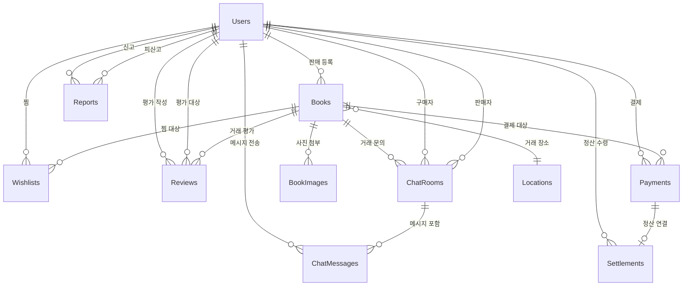

# 📊 Polbook 데이터베이스 ERD 상세 설계

이 문서는 교내 중고 책 거래 서비스 `Polbook`의 모든 테이블 스키마, 컬럼 타입, Primary Key / Foreign Key 관계를 정의합니다.

---

## ERD 다이어그램

---

## 1. Users (사용자)

| 컬럼명 | 타입 | 제약 조건 | 설명 |
|---|---|---|---|
| `user_id` | BIGINT | **PK**, AUTO_INCREMENT | 사용자 고유 ID |
| `student_id` | CHAR(10) | UNIQUE, NOT NULL | 학번 (10자리 고정, 로그인 ID) |
| `email` | VARCHAR(30) | UNIQUE, NOT NULL | `학번@office.kopo.ac.kr` (고정 형식) |
| `password` | VARCHAR(255) | NOT NULL | 암호화된 비밀번호 (BCrypt) |
| `nickname` | VARCHAR(30) | UNIQUE, NOT NULL | 닉네임 |
| `profile_image` | VARCHAR(500) | NULL | 프로필 사진 URL |
| `manner_score` | DECIMAL(3,1) | DEFAULT 36.5 | 매너 온도 (기본 36.5°C) |
| `role` | ENUM('USER','ADMIN') | DEFAULT 'USER' | 사용자 역할 |
| `is_suspended` | BOOLEAN | DEFAULT FALSE | 이용 정지 여부 |
| `suspended_until` | DATETIME | NULL | 정지 해제 일시 |
| `created_at` | DATETIME | DEFAULT NOW() | 가입일 |
| `updated_at` | DATETIME | DEFAULT NOW() | 정보 수정일 |

---

## 2. Books (도서 게시글)

| 컬럼명 | 타입 | 제약 조건 | 설명 |
|---|---|---|---|
| `book_id` | BIGINT | **PK**, AUTO_INCREMENT | 게시글 고유 ID |
| `seller_id` | BIGINT | **FK → Users.user_id**, NOT NULL | 판매자 |
| `title` | VARCHAR(200) | NOT NULL | 책 제목 |
| `category` | ENUM('MAJOR','LIBERAL','CERT') | NOT NULL | 전공/교양/자격증 |
| `department` | VARCHAR(50) | NULL | 학과/전공 (전공 서적일 때만) |
| `grade` | TINYINT | NULL | 학년 (1~4) |
| `semester` | TINYINT | NULL | 학기 (1 또는 2) |
| `course_name` | VARCHAR(100) | NULL | 강의명 |
| `professor` | VARCHAR(50) | NULL | 교수명 |
| `price` | INT | NOT NULL | 판매 가격 (원) |
| `description` | TEXT | NULL | 상세 설명 |
| `book_condition` | ENUM('S','A','B','C') | NOT NULL | 책 상태 등급 |
| `has_notes` | BOOLEAN | DEFAULT FALSE | 필기 여부 |
| `location_id` | BIGINT | **FK → Locations.location_id**, NOT NULL | 거래 장소 |
| `trade_status` | ENUM('SELLING','RESERVED','SOLD') | DEFAULT 'SELLING' | 거래 상태 |
| `view_count` | INT | DEFAULT 0 | 조회수 |
| `created_at` | DATETIME | DEFAULT NOW() | 등록일 |
| `updated_at` | DATETIME | DEFAULT NOW() | 수정일 |

---

## 3. BookImages (도서 사진)

> 한 게시글에 여러 장의 사진을 첨부할 수 있으므로 별도 테이블로 분리합니다.

| 컬럼명 | 타입 | 제약 조건 | 설명 |
|---|---|---|---|
| `image_id` | BIGINT | **PK**, AUTO_INCREMENT | 이미지 고유 ID |
| `book_id` | BIGINT | **FK → Books.book_id**, NOT NULL | 연결된 게시글 |
| `image_url` | VARCHAR(500) | NOT NULL | 이미지 저장 경로 (S3 URL) |
| `display_order` | TINYINT | DEFAULT 1 | 표시 순서 (1 = 대표 이미지) |
| `created_at` | DATETIME | DEFAULT NOW() | 업로드 일시 |

---

## 4. Locations (교내 거래 장소)

| 컬럼명 | 타입 | 제약 조건 | 설명 |
|---|---|---|---|
| `location_id` | BIGINT | **PK**, AUTO_INCREMENT | 장소 고유 ID |
| `name` | VARCHAR(50) | UNIQUE, NOT NULL | 장소명 (예: "본관 입구") |
| `is_active` | BOOLEAN | DEFAULT TRUE | 사용 가능 여부 |

초기 데이터 (Seed):
> 본관, 1기술관, 2기술관, 3기술관, 백두관, 5기술관, 6기술관, 7기술관, 하이테크관, 한라관, 학생회관, 산학협력관

---

## 5. Wishlists (찜 목록)

| 컬럼명 | 타입 | 제약 조건 | 설명 |
|---|---|---|---|
| `wishlist_id` | BIGINT | **PK**, AUTO_INCREMENT | 찜 고유 ID |
| `user_id` | BIGINT | **FK → Users.user_id**, NOT NULL | 찜한 사용자 |
| `book_id` | BIGINT | **FK → Books.book_id**, NOT NULL | 찜한 게시글 |
| `created_at` | DATETIME | DEFAULT NOW() | 찜한 날짜 |

> **UNIQUE 제약:** (`user_id`, `book_id`) → 같은 책을 중복 찜 방지

---

## 6. ChatRooms (채팅방)

| 컬럼명 | 타입 | 제약 조건 | 설명 |
|---|---|---|---|
| `room_id` | BIGINT | **PK**, AUTO_INCREMENT | 채팅방 고유 ID |
| `book_id` | BIGINT | **FK → Books.book_id**, NOT NULL | 연결된 게시글 |
| `buyer_id` | BIGINT | **FK → Users.user_id**, NOT NULL | 구매 희망자 |
| `seller_id` | BIGINT | **FK → Users.user_id**, NOT NULL | 판매자 |
| `is_active` | BOOLEAN | DEFAULT TRUE | 채팅방 활성 여부 |
| `created_at` | DATETIME | DEFAULT NOW() | 생성일 |

> **UNIQUE 제약:** (`book_id`, `buyer_id`) → 같은 책에 대해 같은 구매자가 중복 채팅방 생성 방지

---

## 7. ChatMessages (채팅 메시지)

| 컬럼명 | 타입 | 제약 조건 | 설명 |
|---|---|---|---|
| `message_id` | BIGINT | **PK**, AUTO_INCREMENT | 메시지 고유 ID |
| `room_id` | BIGINT | **FK → ChatRooms.room_id**, NOT NULL | 소속 채팅방 |
| `sender_id` | BIGINT | **FK → Users.user_id**, NOT NULL | 보낸 사람 |
| `content` | TEXT | NOT NULL | 메시지 내용 |
| `is_read` | BOOLEAN | DEFAULT FALSE | 읽음 여부 |
| `sent_at` | DATETIME | DEFAULT NOW() | 전송 시간 |

---

## 8. Payments (결제 내역)

| 컬럼명 | 타입 | 제약 조건 | 설명 |
|---|---|---|---|
| `payment_id` | BIGINT | **PK**, AUTO_INCREMENT | 결제 고유 ID |
| `payment_uid` | VARCHAR(100) | UNIQUE, NOT NULL | PG사 결제 고유번호 |
| `buyer_id` | BIGINT | **FK → Users.user_id**, NOT NULL | 구매자 |
| `book_id` | BIGINT | **FK → Books.book_id**, NOT NULL | 결제 대상 게시글 |
| `amount` | INT | NOT NULL | 결제 금액 (원) |
| `payment_method` | VARCHAR(30) | NOT NULL | 결제 수단 (카드/계좌이체 등) |
| `status` | ENUM('PENDING','ESCROWED','REFUNDED','SETTLED') | DEFAULT 'PENDING' | 결제 상태 |
| `paid_at` | DATETIME | NULL | 결제 완료 일시 |
| `created_at` | DATETIME | DEFAULT NOW() | 생성일 |

> 상태 흐름: `PENDING`(대기) → `ESCROWED`(보관중) → `SETTLED`(정산완료) 또는 `REFUNDED`(환불)

---

## 9. Settlements (정산 내역)

| 컬럼명 | 타입 | 제약 조건 | 설명 |
|---|---|---|---|
| `settlement_id` | BIGINT | **PK**, AUTO_INCREMENT | 정산 고유 ID |
| `payment_id` | BIGINT | **FK → Payments.payment_id**, UNIQUE, NOT NULL | 연결된 결제 |
| `seller_id` | BIGINT | **FK → Users.user_id**, NOT NULL | 판매자 (정산 수령인) |
| `amount` | INT | NOT NULL | 정산 금액 (수수료 차감 후) |
| `status` | ENUM('PENDING','COMPLETED') | DEFAULT 'PENDING' | 정산 상태 |
| `completed_at` | DATETIME | NULL | 정산 완료 일시 |
| `created_at` | DATETIME | DEFAULT NOW() | 생성일 |

---

## 10. Reviews (평점/리뷰)

| 컬럼명 | 타입 | 제약 조건 | 설명 |
|---|---|---|---|
| `review_id` | BIGINT | **PK**, AUTO_INCREMENT | 리뷰 고유 ID |
| `reviewer_id` | BIGINT | **FK → Users.user_id**, NOT NULL | 평가 작성자 |
| `reviewee_id` | BIGINT | **FK → Users.user_id**, NOT NULL | 평가 대상자 |
| `book_id` | BIGINT | **FK → Books.book_id**, NOT NULL | 거래된 게시글 |
| `score` | TINYINT | NOT NULL, CHECK(1~5) | 별점 (1~5) |
| `comment` | VARCHAR(500) | NULL | 한줄 코멘트 |
| `created_at` | DATETIME | DEFAULT NOW() | 작성일 |

> **UNIQUE 제약:** (`reviewer_id`, `book_id`) → 같은 거래에 대해 중복 평가 방지

---

## 11. Reports (신고 내역)

| 컬럼명 | 타입 | 제약 조건 | 설명 |
|---|---|---|---|
| `report_id` | BIGINT | **PK**, AUTO_INCREMENT | 신고 고유 ID |
| `reporter_id` | BIGINT | **FK → Users.user_id**, NOT NULL | 신고자 |
| `reported_id` | BIGINT | **FK → Users.user_id**, NOT NULL | 피신고자 |
| `book_id` | BIGINT | **FK → Books.book_id**, NULL | 관련 게시글 (없을 수도 있음) |
| `reason` | ENUM('NO_SHOW','FRAUD','NON_BOOK','INAPPROPRIATE','OTHER') | NOT NULL | 신고 사유 |
| `detail` | TEXT | NULL | 상세 설명 |
| `status` | ENUM('PENDING','REVIEWED','DISMISSED') | DEFAULT 'PENDING' | 처리 상태 |
| `admin_note` | TEXT | NULL | 관리자 처리 메모 |
| `created_at` | DATETIME | DEFAULT NOW() | 신고일 |
| `resolved_at` | DATETIME | NULL | 처리 완료일 |

---

## 테이블 관계 요약

| 관계 | 설명 |
|---|---|
| Users `1:N` Books | 한 사용자가 여러 책을 등록 |
| Books `1:N` BookImages | 한 게시글에 여러 사진 첨부 |
| Books `N:1` Locations | 여러 게시글이 하나의 장소를 선택 |
| Users `N:M` Books (via Wishlists) | 여러 사용자가 여러 책을 찜 |
| Books `1:N` ChatRooms | 한 게시글에 여러 채팅방 생성 |
| ChatRooms `1:N` ChatMessages | 한 채팅방에 여러 메시지 |
| Books `1:1` Payments | 한 게시글에 하나의 결제 |
| Payments `1:1` Settlements | 하나의 결제에 하나의 정산 |
| Users `1:N` Reviews (작성) | 한 사용자가 여러 리뷰 작성 |
| Users `1:N` Reports (신고) | 한 사용자가 여러 신고 접수 |
