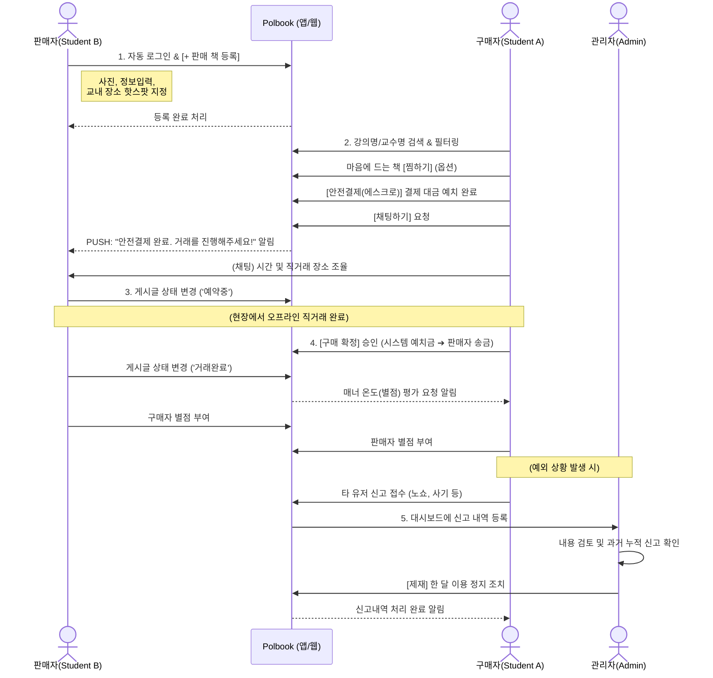

# Polbook 핵심 이용 시나리오 (User Scenarios)

이 문서는 교내 중고 책 거래 서비스 `Polbook`의 주요 사용자층인 **구매자(Student A)**, **판매자(Student B)**, 그리고 **관리자(Admin)**가 서비스를 이용하며 겪게 되는 핵심 시나리오(User Journey)를 정의합니다.

## 🌈 전체 시나리오 요약 시퀀스 다이어그램 (UML)

아래는 판매자, 구매자, 그리고 관리자 간의 전반적인 서비스 이용 흐름을 요약한 시퀀스(Sequence) 다이어그램입니다.

---

## 1. 📚 판매자 (Student B) 시나리오

**목표: 다 쓴 전공 서적을 빠르고 안전하게 판매하여 용돈을 마련하고 싶다.**

1. **로그인 및 책 등록 시작**
   - Polbook 앱/웹에 교내 이메일 계정으로 자동 로그인된 상태로 접속합니다.
   - 메인 홈 화면 우측 하단의 **[+ 판매 책 등록]** 플로팅 버튼을 클릭합니다.
2. **상세 정보 입력 및 등록**
   - 휴대폰 카메라로 책의 앞/뒷면과 필기 상태를 찍어 사진을 첨부합니다.
   - 책 제목, 카테고리(`전공 서적`), 학년/학기, 강의명, 교수명, 판매 희망 가격을 입력합니다.
   - 판매자가 주로 생활하는 **특정 교내 핫스팟**(예: `제1공학관 로비`)을 거래 희망 장소로 선택 후 [등록하기]를 누릅니다.
3. **구매자 연락 및 안전 거래 약속**
   - 구매자로부터 "책 구매 가능할까요?"라는 채팅 알림(Push Notification)이 옵니다.
   - 채팅을 통해 시간과 장소(제1공학관 로비)를 정하고, 구매자가 플랫폼 내 **[안전결제(에스크로)]**를 통해 책값을 미리 결제(시스템 보관)했다는 알림을 받습니다.
   - 다른 사람이 더 이상 구매 요청을 할 수 없도록 게시글 상태를 **'예약중'**으로 확인/변경합니다.
4. **직거래 도서 전달 및 구매 확정 (정산)**
   - 약속된 시간에 교내 건물 로비에서 만나 책을 건네줍니다.
   - 구매자가 현장에서 책을 확인한 뒤 **[구매 확정]** 버튼을 누르면, 시스템에 보관되어 있던 결제 대금이 판매자의 시스템 지갑/계좌로 안전하게 정산됩니다.
   - 앱을 켜서 상태를 **'거래완료'**로 변경하고, 구매자에 대한 매너 온도(별점 5점)를 남깁니다.

---

## 2. 📖 구매자 (Student A) 시나리오

**목표: 새 학기에 필요한 비싼 전공 서적을 저렴한 가격에, 교내에서 당일 직거래로 구하고 싶다.**

1. **도서 검색 및 탐색**
   - 앱을 켜고 메인 홈 화면 검색창에 이번 학기 수강할 `강의명` 혹은 `교수명`이나 `책 제목`을 검색합니다.
   - 필터 기능을 통해 `전공 서적`, 학과, 학년 등을 조건으로 걸어 목록을 좁힙니다.
   - 원하는 책을 발견하면 상세 페이지에 들어가 필기 여부와 사진, 판매자가 정해둔 거래 장소(`제1공학관 로비`)를 확인합니다.
2. **찜하기 혹은 안전결제 구매 요청**
   - 당장 사지 않더라도 나중에 보기 위해 하트(♡) 버튼을 눌러 **'찜 목록'**에 담아둡니다.
   - 확정이 섰을 때 **[안전결제(에스크로)]** 버튼을 눌러, 내 계좌/카드 등을 통해 Polbook 시스템에 책값을 안전하게 예치(보관)해 둡니다.
   - 하단의 **[채팅하기]** 버튼을 눌러 판매자에게 연락합니다.
3. **오프라인 거래 및 구매 확정(송금 승인)**
   - 채팅으로 오후 3시에 제1공학관 로비에서 만나기로 합의합니다.
   - 현장에서 책을 받아보고, 사진과 동일하고 훼손이 없는지 꼼꼼하게 상태를 확인합니다.
   - 이상이 없음을 확인한 뒤 그 자리에서 앱 내의 **[구매 확정]** 버튼을 누릅니다. 비로소 보관되던 내 결제 대금이 판매자에게 안전하게 송금됩니다.
   - 판매자가 '거래완료' 처리를 하면 리뷰 작성 알림이 오며 판매자의 매너 온도에 별점을 부여합니다.

---

## 3. 🛡️ 관리자 (Admin) 시나리오

**목표: 안전하고 깨끗한 교내 중고 거래 플랫폼 환경을 유지하고 불량 유저를 제재한다.**

1. **신고 접수 및 대시보드 확인**
   - 관리자 전용 웹 페이지(Admin Dashboard)에 로그인합니다.
   - 접수된 '신고 목록' 메뉴에 들어갑니다. 누군가 채팅방에서 욕설을 하거나, 노쇼(약속을 잡고 안 나타남)를 한 유저에 대한 신고 건이 접수되어 있습니다.
2. **신고 내용 검토**
   - 신고된 유저의 채팅 내역(권한이 있는 경우)이나 상대방이 캡처하여 올린 사유를 확인합니다.
   - 해당 유저가 과거에도 유사한 사유로 누적 신고 3회를 받은 이력을 확인합니다.
3. **제재 조치(패널티) 부여**
   - 해당 악성 유저의 상태를 `정상` ➔ `한 달 이용 정지`로 변경 버튼을 눌러 처리합니다.
   - 플랫폼 내에서 다른 선량한 학생들이 피해를 보지 않도록 즉각 조치하며, 신고자에게는 "신고하신 사항이 정상 처리되었습니다"라는 알림을 전송하여 신뢰도를 높입니다.
